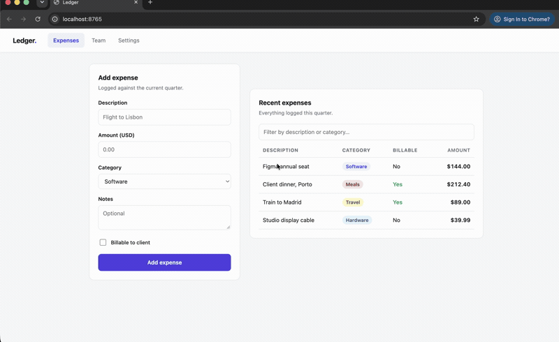
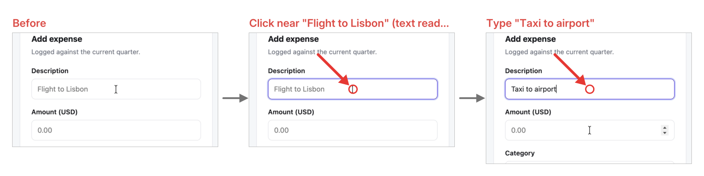
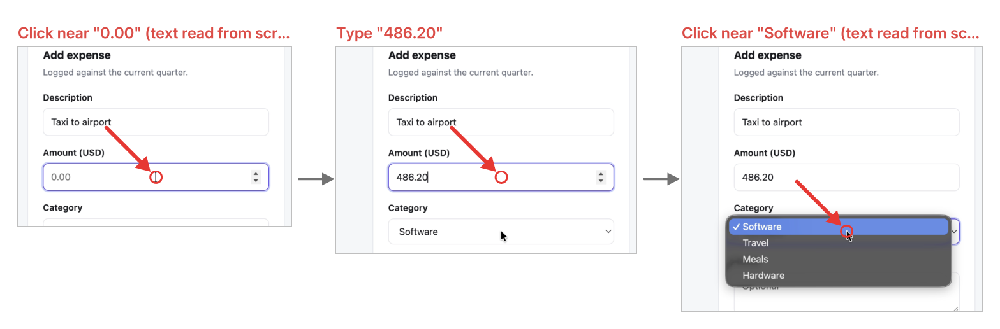
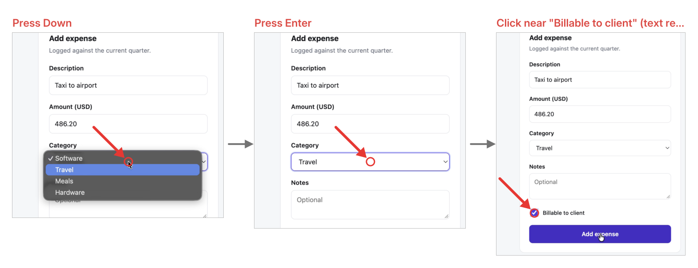
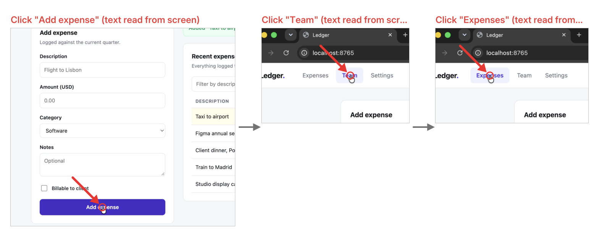

# agent-snap

Token-efficient screen recording for coding agents. macOS and Windows.

`agent-snap` records a normal screen video (the source of truth) plus a timestamped
log of everything that happened: every frame's arrival and changed area, every
click, keystroke burst, scroll, drag, cursor movement, and window switch, with
app/window/URL and, when the app answers quickly, the accessibility name of the
element. The builder then reads frames straight out of the video, finds when the
screen settled after each input, crops to where the change happened, and writes
`flow.md`: one focused composite per window visit, with labels and arrows. Clicks
without a usable accessibility name are labeled by reading the text under the
cursor from the pixels (OCR), so any app works.

Three full screenshots ≈ 4.8k tokens and unreadable after downscale. One composite
≈ 1.4k tokens and readable.

## Tray app

```sh
cargo build --release
scripts/make-app.sh && open dist/AgentSnap.app     # macOS
```

Viewfinder icon in the menu bar (macOS) or notification area (Windows). Clicking it
opens a popover with permission status and Grant buttons, settings (output folder,
typed text, browser URLs, no-input updates, panels per image, panel width, settle
time), arrows to browse past recordings, and a REC/STOP button. The icon turns into
a red dot while recording, and interactions with the popover itself are not
recorded. When you stop, it builds `flow.md` and offers Copy prompt / Open / Reveal.

"Copy prompt" puts a one-line instruction plus the absolute path on your clipboard.
Paste that into any agent. Images cannot travel through the clipboard, so the agent
reads the file and follows the image links itself.

## Example

A 24-second recording of someone filling in an expense form and switching tabs, on a
small demo page (`smoke/index.html`). agent-snap turned it into `flow.md` at about
**5,200 tokens**: four composites plus eleven step lines. That is the whole prompt you
paste into an agent.



*(the compressed clip that ships in the repo; [full-resolution mp4](docs/example/recording.mp4))*

What the agent actually
reads is [`docs/example/flow.md`](docs/example/flow.md) and its four composites:






Every click and keystroke is labelled and pointed at with an arrow. Where the app gave no
usable accessibility name, the label is read from the pixels under the cursor (marked "text
read from screen"), so it works the same on a native app or a web page. The category
dropdown opening and the value landing on Travel, the billable checkbox being ticked, and
the two tab switches all survive into the flow.

The test is reproducible: `smoke/run.sh` serves the page, opens a throwaway Chrome window,
records with agent-snap, and drives the form with real mouse and keyboard events (a small
signed helper in `smoke/`, since screen-recording input taps only see real OS events). The
`smoke/` folder is gitignored; only the finished example under `docs/example/` is committed.

## CLI

```sh
cargo build --release
target/release/agent-snap record                      # Ctrl+C to stop
target/release/agent-snap record --duration 30 --out sessions/demo
target/release/agent-snap build sessions/demo         # rebuild flow.md
```

Output directory:

```
sessions/<stamp>/
  recording.mp4       the video (HEVC when the GPU offers it, 30fps, cursor visible)
  session.json        frame log, steps, window timeline, AX targets, pixel coords
  frames/*.png        keyframes pulled from the video (before/after each step)
  composites/*.png    focused panels with labels + arrows
  flow.md             what to paste to the agent
```

`ffmpeg` is used for encoding and frame extraction. It is taken from `PATH` when
present, otherwise downloaded once into the app data directory.

## Permissions

**macOS.** Grant Screen Recording and Accessibility. The tray app attributes them to
`AgentSnap.app`; the CLI attributes them to whatever terminal you ran it from.
macOS ties Accessibility to the code signature, so an ad-hoc signed build loses the
grant on every rebuild. `make-app.sh` signs with a self-signed "AgentSnap Dev"
certificate when one exists in the login keychain, which keeps the grant stable. If
permissions look granted but the app still says no, reset and re-grant:

```sh
tccutil reset Accessibility com.fazolo.agent-snap
tccutil reset ScreenCapture com.fazolo.agent-snap
```

Automation permission is asked for once, the first time a browser tab URL is read.

**Windows.** Nothing to grant. Screen capture, the input hooks and UI Automation all
work without a permission prompt.

## Layout

```
crates/core      OS-neutral: session model, gesture coalescing, recording
                 orchestration, ffmpeg encode/decode, and the flow.md builder
crates/macos     ScreenCaptureKit, CGEventTap, Accessibility, Vision OCR
crates/windows   Windows.Graphics.Capture, low-level hooks, UI Automation, Windows OCR
app              the binary: CLI + Tauri tray with the popover
```

Everything platform-specific sits behind five traits in `crates/core/src/platform.rs`:
`ScreenCapture`, `InputTap`, `WindowTracker`, `Ocr`, `Permissions`. A new OS means
implementing those and nothing else.

## How it works

- **Capture.** The OS delivers a frame when pixels change, with the changed
  rectangles. The recorder writes one frame per 1/30s tick, repeating the last frame
  when nothing changed, so the file is constant-fps and the cursor is always in it.
- **Input.** A listen-only global tap records mouse and keyboard without swallowing
  anything.
- **Semantics.** Raw events coalesce into gestures: click, double/right click, drag,
  typed text (1s gap), key chord, scroll, and sustained cursor movement with no
  click. Repeated identical clicks are kept, not merged; they are how an agent can
  tell a page stopped responding.
- **Window tracking.** Frontmost app and window, browser tab URL, a hit-test on
  click, the focused element on typing. Password fields are redacted. Nothing waits
  on accessibility, and no app-specific tricks are used.
- **Builder.** Reads frames out of the video, computes settle time from the frame log
  (quiet gap, 2s max), synthesizes "Screen updated" steps from large repaints that
  had no input, and OCRs the click target when accessibility gave nothing useful.
  The focus rect is the changed cells near the click plus the target bounds, padded,
  min 700×450, max 1800×1200, clamped to the window, and held stable across
  consecutive steps. Panels that changed less than 2% become a text-only line.

## Not yet

- Windows backend is written and type-checks, but is untested on real hardware
- Linux capture and input backends
- multi-display (primary display only)
- merging panels that show the same thing twice
